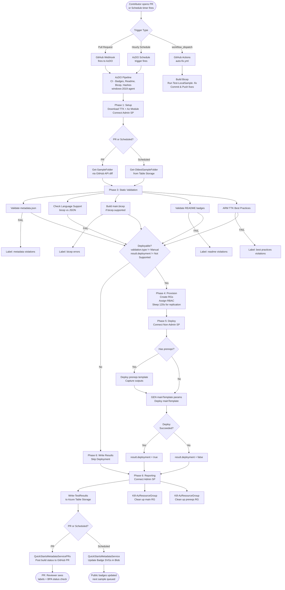

# CI/CD Pipeline Documentation

> Azure Quickstart Templates — CI/CD Architecture, Pipelines, and Automation Reference

---

## Table of Contents

1. [Architecture Overview](#1-architecture-overview)
2. [Pipeline Triggers](#2-pipeline-triggers)
3. [Repository Automation Files](#3-repository-automation-files)
4. [Azure DevOps Pipeline: Full Step-by-Step Flow](#4-azure-devops-pipeline-full-step-by-step-flow)
5. [Conditional Execution Logic](#5-conditional-execution-logic)
6. [GitHub Label System](#6-github-label-system)
7. [CI Scripts Reference](#7-ci-scripts-reference)
8. [Pipeline Variables Reference](#8-pipeline-variables-reference)
9. [Azure Storage Integration](#9-azure-storage-integration)
10. [GitHub Actions Workflow](#10-github-actions-workflow)
11. [PR Lifecycle](#11-pr-lifecycle)
12. [Setting Up the Pipeline in a New AzDO Project](#12-setting-up-the-pipeline-in-a-new-azdo-project)
13. [Architecture Diagram](#13-architecture-diagram)

---

## 1. Architecture Overview

The CI/CD system spans two platforms: **GitHub** (source, PR management, lightweight automation) and **Azure DevOps** (heavy CI execution, deployment validation, badge publishing).

```
GitHub PR / Scheduled Clock
        │
        ▼
  GitHub Webhook ──────────► Azure DevOps
  (PR events, push)           (azurequickstarts org)
                               Pipeline: CI - Badges, Readme, Bicep, Hashes
                               Agent: windows-2019
                               Timeout: 360 min
                                    │
                        ┌───────────┼────────────────┐
                        ▼           ▼                 ▼
                  Validation    ARM Deploy       Badge/Results
                  (meta, BPA,   (West US)        (Azure Blob +
                   README,       real Azure       Table Storage)
                   Bicep build)  subscription
```

### Key Infrastructure

| Component | Value |
|---|---|
| AzDO Organization | `dev.azure.com/azurequickstarts` |
| AzDO Project | `azure-quickstart-templates` (ID: `b191bd7a-37bb-47b0-870c-3f1270a79b3d`) |
| Pipeline Name | `CI - Badges, Readme, Bicep, Hashes` (JSON export name: `AzQuickStarts-New-Public-Staging`) |
| Pipeline Definition ID | `27` (revision 19) |
| Agent Pool | `windows-2019` |
| Job Timeout | 360 minutes |
| Deploy Region | `westus` |
| Azure Subscription | `0cec7090-2e08-4498-9337-eb96ade50821` |
| Storage Account | `azurequickstartsservice` |
| GitHub Service Connection | `eae281a4-7f99-47d5-bbd4-2ec4d0d0f865` |

### Service Principals

| Purpose | App ID |
|---|---|
| Non-admin (template deployment) | `244790b2-d023-403d-8814-b4ecfe847e55` (`app.id`) |
| Admin (RG create/delete, RBAC) | `05ff27fb-fcd2-4bae-97ee-4e60a67ff73b` (`app.id.admin`) |

---

## 2. Pipeline Triggers

### 2.1 Pull Request Trigger (`triggerType: 64`)

Fires on every PR targeting the `master` branch.

**Source**: GitHub webhook → AzDO GitHub Service Connection

**Branch filter**: `+master` (only PRs into master)

**Path exclusions** (PRs touching only these paths are skipped):
- `/test/*`
- `/1-CONTRIBUTION-GUIDE/*`
- `/.github/*`

**Fork PRs**: Enabled with `allowSecrets: true` (fork pipeline definition: `test/pipeline/pipeline.import.fork.json`)

### 2.2 Scheduled Trigger (`triggerType: 8`)

24 schedule entries covering every hour of every day of the week, in Pacific Standard Time.

| Frequency | Schedule |
|---|---|
| Runs per hour | 2 (at :00 and :30 past the top of each hour) |
| Days | All 7 days (`daysToBuild: 127`) |
| Timezone | Pacific Standard Time |
| Purpose | Re-validate existing samples nightly; generate fresh badges |

Scheduled runs use `Get-OldestSampleFolder.ps1` to select the next sample to validate round-robin, rather than a PR diff.

### 2.3 Manual Trigger (GitHub Actions)

A `workflow_dispatch` event in `.github/workflows/auto-fix.yml` allows a maintainer to manually trigger an auto-fix pass on the most recently updated sample in a branch. This does **not** run the AzDO pipeline — it runs entirely in GitHub Actions.

---

## 3. Repository Automation Files

### 3.1 Azure DevOps Pipeline Definitions

| File | Purpose |
|---|---|
| `test/pipeline/pipeline.import.azure.master.json` | Full production pipeline (PR + hourly schedules). Import into AzDO to recreate. |
| `test/pipeline/pipeline.import.fork.json` | Simpler pipeline variant for fork PRs (older). |

### 3.2 GitHub Actions

| File | Trigger | Purpose |
|---|---|---|
| `.github/workflows/auto-fix.yml` | `workflow_dispatch` (manual only) | Finds most recently changed sample via `git log`, builds `main.bicep` → `azuredeploy.json`, runs `Test-LocalSample.ps1 -fix`, commits and pushes fixes back to the branch. |

### 3.3 GitHub Probot / GitOps

| File | Tool | Purpose |
|---|---|---|
| `.github/stale.yml` | Probot Stale | Labels PRs `review-abandoned` after 30 days of inactivity; closes them after 7 more days. Exempt if labeled `pinned`. |
| `.github/policies/resourceManagement.yml` | GitOps Policy Bot | Adds `needs/author feedback` when reviewer requests changes; removes it on author activity; adds `status/no recent activity` after 15 days on `needs/author feedback` PRs. |

---

## 4. Azure DevOps Pipeline: Full Step-by-Step Flow

All steps run on `windows-2019` using `pwsh` (PowerShell Core). Steps reference scripts from `$(ttk.folder)/ci-scripts/` (downloaded at runtime from Azure Blob Storage).

---

### Phase 1 — Setup & Download

| # | Step | Condition | Script |
|---|---|---|---|
| 1 | **Download TTK and CI Scripts** | Always | Checks for `use-staging-scripts` PR label; downloads `arm-template-toolkit.zip` from production or staging blob URL; extracts to `$(ttk.folder)`. |
| 2 | **Install Az PowerShell Module** | Always | Downloads `Az` module zip from `$(az.module.uri)` blob and installs. |
| 3 | **Connect To Azure (Admin)** | Always | `ConnectTo-Azure.ps1` using `app.id.admin` — admin service principal with RBAC permissions to create/delete Resource Groups. |

---

### Phase 2 — Sample Discovery

| # | Step | Condition | Script |
|---|---|---|---|
| 4 | **Get Oldest Sample Folder** | Scheduled / Manual only | `Get-OldestSampleFolder.ps1` — selects the sample with the oldest last-validated timestamp from Azure Table Storage for round-robin nightly re-validation. |
| 5 | **Set Build Number** | Scheduled / Manual only | Sets the AzDO build number to reflect the sample being processed. |
| 6 | **Get Sample Folder (Pull Request)** | PR only | `Get-SampleFolder.ps1` — calls GitHub API `/repos/{repo}/pulls/{pr}/files` to find which sample folder changed; enforces single-sample-per-PR rule; sets `$(sample.folder)`. |

---

### Phase 3 — Static Validation

| # | Step | Condition | Script / Action | Output Variable |
|---|---|---|---|---|
| 7 | **Validate metadata.json** | Always | `Validate-Metadata.ps1` — validates against JSON schema at `https://aka.ms/azure-quickstart-templates-metadata-schema` | `result.metadata`, `validation.type`, `supported.environments` |
| 8 | **Check Misc Labels** | Always | `Check-MiscLabels.ps1` — applies or removes misc GitHub PR labels | — |
| 9 | **Label: PORTAL SAMPLE** | PR only | Adds/removes `PORTAL SAMPLE` label if sample is portal-facing | — |
| 10 | **Label: ROOT** | PR only | Adds/removes `ROOT` label if files changed at repository root | — |
| 11 | **Label: UPPERCASE** | PR only | Adds/removes `UPPERCASE` label if folder name has uppercase chars | — |
| 12 | **Label: manual validation required** | PR only | Applied when `validation.type == Manual` | — |
| 13 | **Label: metadata violations** | PR only | Add/remove based on `result.metadata` | — |
| 14 | **Check Language Support** | Always | `Check-LanguageSupport.ps1` — detects whether `main.bicep` and/or `azuredeploy.json`/`mainTemplate.json` exist | `bicep.supported`, `mainTemplate.filename.json`, `mainTemplate.deployment.filename` |
| 15 | **Check Bicep Decompile** | PR only, if `bicep.supported` | `Check-BicepDecompile.ps1` — checks if Bicep can cleanly decompile back to ARM | — |
| 16 | **Label: bicep** | PR only | Applied if `bicep.supported == true` | — |
| 17 | **Label: bicep-decompile** | PR only | Applied if Bicep decompile check passes | — |
| 18 | **Install Bicep CLI** | If `bicep.supported` | `Install-Bicep.ps1` | — |
| 19 | **Build and Validate main.bicep** | If `bicep.supported` | `Validate-DeploymentFile.ps1` — runs `bicep build`, captures errors | `result.bicep.build` |
| 20 | **Label: bicep errors** | PR only | Add/remove based on `result.bicep.build` | — |
| 21 | **PR Comment: Doc Owner** | PR only | Pings `docOwner` from `metadata.json` as PR comment | — |
| 22 | **Check for MOVE PR** | PR only | If PR title contains `MOVE:` and has `docOwner`, pings specific reviewers (`mumian`, `TomFitz`) | — |
| 23 | **Validate README.md** | Always | `Validate-ReadMe.ps1` — checks presence and correctness of Deploy-to-Azure badge, badge SVG link, ARM Visualizer button, Bicep badge (if applicable) | `result.readme` |
| 24 | **Label: readme violations** | PR only | Add/remove based on `result.readme` | — |
| 25 | **Run Best Practices Tests (ARM TTK)** | Always | `Test-BestPractices.ps1` — runs `Test-AzTemplate` from ARM TTK; skips test `DeploymentParameters Should Have Value` | `result.best.practice` |
| 26 | **Label: best practices violations** | PR only | Add/remove based on `result.best.practice` | — |

---

### Phase 4 — Infrastructure Provisioning

These steps are skipped when `result.deployment == "Not Supported"` or `validation.type == "Manual"`.

| # | Step | Condition | Action |
|---|---|---|---|
| 27 | **Check for Prereqs** | Always (if deployable) | `Check-Prereqs.ps1` — checks if `prereqs/` folder exists; sets `deploy.prereqs`, `prereq.deployment.name`, `prereq.outputs.filename` |
| 28 | **Generate Resource Group Names** | Always (if deployable) | `Gen-ResourceGroupNames.ps1` — generates unique RG names for main template and prereqs |
| 29 | **Create RG + Assign RBAC (main)** | Always (if deployable) | Inline — `New-AzResourceGroup` + `New-AzRoleAssignment` for non-admin SP on main RG |
| 30 | **Create RG + Assign RBAC (prereqs)** | Always (if deployable) | Inline — same as above for prereqs RG |
| 31 | **Sleep 120 seconds** | Always (if deployable) | Waits `$(wait.role.assignment.seconds)` = 120s for Azure RBAC replication |
| 32 | **Connect To Azure (Non-Admin)** | Always (if deployable) | `ConnectTo-Azure.ps1` using `app.id` — non-admin SP used for actual template deployment |

---

### Phase 5 — Template Deployment

| # | Step | Condition | Action |
|---|---|---|---|
| 33 | **GEN Parameters (Prereqs)** | If `deploy.prereqs == true` | `Gen-TemplateParameters.ps1` — generates parameter file for prerequisites template using GEN config from blob storage |
| 34 | **Deploy Prerequisites** | If `deploy.prereqs == true` | `Deploy-AzTemplate.ps1` — deploys `prereqs/azuredeploy.json` to prereqs RG |
| 35 | **Dump Prereqs Outputs to File** | If `deploy.prereqs == true` | Inline — reads `Get-AzResourceGroupDeployment` outputs; writes to `prereqs/$(prereq.outputs.filename)` as JSON |
| 36 | **DEBUG: Dump Prereqs Output File** | If `deploy.prereqs == true` | Debug trace of the prereqs output file |
| 37 | **GEN mainTemplate Parameters** | Always (if deployable) | `Gen-TemplateParameters.ps1` — generates `$(gen.parameters.filename)` for main template; incorporates prereqs outputs if present |
| 38 | **DEBUG: Dump mainTemplate Param File** | Always (if deployable) | Debug trace of generated parameter file |
| 39 | **Deploy mainTemplate** | Always (if deployable) | Inline — calls `Deploy-AzTemplate.ps1` with `$(mainTemplate.deployment.filename)`, generated params, `$(resourceGroup.name)`, `$(Location)=westus`; sets `result.deployment=true` on success |

---

### Phase 6 — Reporting & Cleanup

| # | Step | Condition | Action |
|---|---|---|---|
| 40 | **Connect To Azure (Admin) To Clean Up** | If deployable | Re-connects with `app.id.admin` so cleanup has permission to delete RGs |
| 41 | **DEBUG: Dump ENV** | Always (`succeededOrFailed`) | Dumps all environment variables for diagnostics |
| 42 | **Write Test Results** | `always()` (`continueOnError: true`) | `Write-TestResults.ps1` — writes `result.deployment`, all result variables to Azure Table Storage (`QuickStartsMetadataService` for scheduled, `QuickStartsMetadataServicePRs` for PR runs); detects regressions; updates badge SVG files in blob storage |
| 43 | **Clean Up RG (main)** | If deployable | Inline — calls `Kill-AzResourceGroup.ps1`; if RG still present after first attempt, sleeps 600s and retries |
| 44 | **Clean Up RG (prereqs)** | If deployable and `prereq.resourceGroup.name != resourceGroup.name` | Same retry logic as main RG cleanup |

---

## 5. Conditional Execution Logic

### Deployment Skip Conditions

A template deployment is skipped (all Phase 4–5 steps bypass) when **any** of the following are true:

| Condition | Source |
|---|---|
| `result.deployment == "Not Supported"` | Set by `Validate-Metadata.ps1` when cloud is unsupported or template isn't deployable |
| `validation.type == "Manual"` | Set by `Validate-Metadata.ps1` when `metadata.json` specifies manual-only validation |

### PR vs Scheduled Branch

```
IF Build.Reason == "PullRequest"
    → Use Get-SampleFolder.ps1 (reads PR diff via GitHub API)
    → Apply/remove GitHub labels on the PR
    → Write results to QuickStartsMetadataServicePRs table

IF Build.Reason == "Schedule" OR "Manual"
    → Use Get-OldestSampleFolder.ps1 (round-robin from Table Storage)
    → No label operations
    → Write results to QuickStartsMetadataService table (updates public badges)
```

### Bicep Branch

```
IF main.bicep exists in sample folder
    → bicep.supported = true
    → Install Bicep CLI
    → Build main.bicep → azuredeploy.json
    → Validate bicep build result
    → Run ARM TTK against generated JSON
    → mainTemplate.deployment.filename = azuredeploy.json (from bicep build)

IF only azuredeploy.json / mainTemplate.json exists
    → bicep.supported = false
    → Skip bicep steps
    → ARM TTK runs directly on azuredeploy.json
    → mainTemplate.deployment.filename = azuredeploy.json or mainTemplate.json
```

---

## 6. GitHub Label System

Labels are applied or removed by AzDO pipeline steps via the GitHub API during PR runs.

### Validation Result Labels

| Label | Applied When | Removed When |
|---|---|---|
| `metadata violations` | `result.metadata == FAIL` | `result.metadata == PASS` |
| `readme violations` | `result.readme == FAIL` | `result.readme == PASS` |
| `best practices violations` | `result.best.practice != true` | `result.best.practice == true` |
| `bicep errors` | `result.bicep.build == FAIL` | `result.bicep.build == PASS` |

### Informational Labels

| Label | Meaning |
|---|---|
| `bicep` | Sample contains `main.bicep` |
| `bicep-decompile` | Bicep file cleanly decompiles back to ARM JSON |
| `PORTAL SAMPLE` | Sample is surfaced via Azure Portal |
| `ROOT` | PR modifies files at repository root level |
| `UPPERCASE` | Sample folder name contains uppercase characters |
| `manual validation required` | `validation.type == Manual` in `metadata.json` |

### Lifecycle Labels (Probot / Policy Bot)

| Label | Source | Meaning |
|---|---|---|
| `needs/author feedback` | `.github/policies/resourceManagement.yml` | Reviewer requested changes; author needs to respond |
| `status/no recent activity` | `.github/policies/resourceManagement.yml` | No activity for 15 days on a PR with `needs/author feedback` |
| `review-abandoned` | `.github/stale.yml` | PR inactive 30 days |
| `pinned` | Manual | Prevents stale bot from closing the PR |

---

## 7. CI Scripts Reference

All scripts live in `test/ci-scripts/` (also bundled inside `arm-template-toolkit.zip` at runtime as `$(ttk.folder)/ci-scripts/`).

| Script | Purpose | Key Outputs |
|---|---|---|
| `Get-SampleFolder.ps1` | Identifies changed sample folder from PR diff via GitHub API | `$(sample.folder)` |
| `Get-OldestSampleFolder.ps1` | Picks the sample due for scheduled re-validation | `$(sample.folder)` |
| `Validate-Metadata.ps1` | Validates `metadata.json` against official schema | `result.metadata`, `validation.type`, `supported.environments`, `result.deployment` |
| `Check-LanguageSupport.ps1` | Detects `main.bicep` / `azuredeploy.json` presence | `bicep.supported`, `mainTemplate.filename.json`, `mainTemplate.deployment.filename` |
| `Check-BicepDecompile.ps1` | Validates bicep decompile round-trip | PR label signal |
| `Install-Bicep.ps1` | Downloads and installs Bicep CLI | — |
| `Validate-DeploymentFile.ps1` | Runs `bicep build`; captures errors | `result.bicep.build` |
| `Validate-ReadMe.ps1` | Validates README.md Deploy-to-Azure badges and links | `result.readme` |
| `Test-BestPractices.ps1` | Runs `Test-AzTemplate` (ARM TTK) | `result.best.practice` |
| `Check-MiscLabels.ps1` | Applies/removes miscellaneous PR labels | PR labels |
| `Check-Prereqs.ps1` | Detects `prereqs/` folder; sets prereq flags | `deploy.prereqs`, `prereq.deployment.name` |
| `Gen-ResourceGroupNames.ps1` | Generates unique RG names for the run | `resourceGroup.name`, `prereq.resourceGroup.name` |
| `Gen-TemplateParameters.ps1` | Generates GEN parameters from blob config + prereq outputs | `$(gen.parameters.filename)` |
| `ConnectTo-Azure.ps1` | Connects `Az` PowerShell to Azure using a service principal | Azure session |
| `Deploy-AzTemplate.ps1` | Deploys an ARM/Bicep template to a Resource Group | — |
| `Kill-AzResourceGroup.ps1` | Deletes a Resource Group with retry logic | — |
| `Write-TestResults.ps1` | Writes all result variables to Azure Table Storage; updates badge SVGs in blob | Badge SVGs, Table rows |
| `Test-LocalSample.ps1` | Developer-facing: runs all validations locally; supports `-Fix` flag | Console output |

---

## 8. Pipeline Variables Reference

### Fixed Configuration Variables

| Variable | Value | Purpose |
|---|---|---|
| `app.id` | `244790b2-d023-403d-8814-b4ecfe847e55` | Non-admin service principal for template deployment |
| `app.id.admin` | `05ff27fb-fcd2-4bae-97ee-4e60a67ff73b` | Admin service principal for RG management |
| `subscription.id` | `0cec7090-2e08-4498-9337-eb96ade50821` | Target Azure subscription |
| `tenant.id` | `6457d1f2-4394-4fc2-b163-e46ffcbbec5c` | Azure AD tenant |
| `location` | `westus` | Default deploy region |
| `storage.account.name` | `azurequickstartsservice` | Azure Storage for badges and results |
| `wait.role.assignment.seconds` | `120` | Seconds to wait after RBAC assignment |
| `ttk.skip.tests` | `DeploymentParameters Should Have Value` | ARM TTK tests to skip |
| `ttk.uri` | `https://azurequickstartsservice.blob.core.windows.net/ttk/staging/arm-template-toolkit.zip` | Default TTK download location |

### Secrets (set in AzDO, not in JSON)

| Variable | Purpose |
|---|---|
| `app.secret` | Non-admin SP client secret |
| `app.secret.admin` | Admin SP client secret |
| `storage.account.key` | Key for `azurequickstartsservice` storage account |

### Runtime Variables (set dynamically during run)

| Variable | Set By | Meaning |
|---|---|---|
| `sample.folder` | `Get-SampleFolder` / `Get-OldestSampleFolder` | Absolute path to sample being validated |
| `bicep.supported` | `Check-LanguageSupport` | `true` if `main.bicep` found |
| `mainTemplate.filename.json` | `Check-LanguageSupport` | Filename of JSON template |
| `mainTemplate.deployment.filename` | `Check-LanguageSupport` | Template file used for actual deployment |
| `validation.type` | `Validate-Metadata` | `Manual`, `Deployment`, etc. |
| `result.metadata` | `Validate-Metadata` | `PASS` or `FAIL` |
| `result.readme` | `Validate-ReadMe` | `PASS` or `FAIL` |
| `result.best.practice` | `Test-BestPractices` | `true` or `FAIL` |
| `result.bicep.build` | `Validate-DeploymentFile` | `PASS` or `FAIL` |
| `result.deployment` | Deploy step / `Validate-Metadata` | `true`, `false`, or `Not Supported` |
| `deploy.prereqs` | `Check-Prereqs` | `true` if prereqs folder found |
| `resourceGroup.name` | `Gen-ResourceGroupNames` | Main template RG name for this run |
| `prereq.resourceGroup.name` | `Gen-ResourceGroupNames` | Prereqs RG name |
| `prereq.deployment.name` | `Check-Prereqs` | AzDO deployment name for prereqs |
| `mainTemplate.deployment.name` | Generated | AzDO deployment name for main template |
| `gen.parameters.filename` | Generated | Filename of GEN-generated parameter file |

---

## 9. Azure Storage Integration

Storage account: `azurequickstartsservice`

### Blobs

| Container / Path | Contents |
|---|---|
| `ttk/staging/arm-template-toolkit.zip` | ARM TTK + CI scripts bundle (staging URL) |
| `ttk/arm-template-toolkit.zip` | ARM TTK + CI scripts bundle (production URL via `https://aka.ms/arm-ttk-latest`) |
| `az-module/` | Az PowerShell module zip |
| `badges/` | SVG badge files (one per sample), updated by `Write-TestResults.ps1` |
| GEN config paths | Per-sample parameter generation config files referenced by `$(config.file.uri)` |

### Tables

| Table | Used When | Contains |
|---|---|---|
| `QuickStartsMetadataService` | Scheduled / master branch runs | Canonical test results per sample; read by `Get-OldestSampleFolder` to pick next sample; badge data |
| `QuickStartsMetadataServicePRs` | PR runs | Temporary per-PR results; regression detection vs `QuickStartsMetadataService` |

**Fields tracked per sample:**
- `BestPracticeResult`
- `CredScanResult`
- `PublicDeployment` (West US deploy result)
- `FairfaxDeployment` (US Gov deploy result)
- `BicepVersion`
- `TemplateAnalyzerResult`

---

## 10. GitHub Actions Workflow

### `.github/workflows/auto-fix.yml` — Auto-Fix on Demand

**Trigger**: `workflow_dispatch` (manual only — maintainers trigger via GitHub UI)

**Steps:**

1. Checkout repository
2. Setup .NET SDK
3. Install ARM TTK (from `https://aka.ms/arm-ttk-latest`)
4. Install Bicep CLI
5. Install PowerShell modules
6. Find the most recently modified sample folder via `git log --diff-filter=d --name-only HEAD..origin/master`
7. If `main.bicep` found: run `bicep build` → regenerate `azuredeploy.json`
8. Run `Test-LocalSample.ps1 -fix` against the sample
9. `git add`, `git commit`, `git push` back to the same branch

**Purpose**: Allows a maintainer to automatically apply fixable lint/formatting issues to a PR branch without waiting for the full AzDO pipeline.

---

## 11. PR Lifecycle

```
1. Contributor opens PR
        ↓
2. GitHub webhook fires → AzDO pipeline triggered
        ↓
3. Phase 1: Setup (download TTK, install Az, connect admin SP)
        ↓
4. Phase 2: Sample discovery (Get-SampleFolder via GitHub API)
        ↓
5. Phase 3: Static validation
   ├── Validate metadata.json → label: metadata violations
   ├── Check language support → label: bicep
   ├── Build main.bicep (if present) → label: bicep errors
   ├── Validate README badges → label: readme violations
   └── Run ARM TTK (BPA) → label: best practices violations
        ↓
6. Phase 4–5: Deployment (skipped if Manual or Not Supported)
   ├── Create RGs + assign RBAC
   ├── Deploy prereqs (if any)
   └── Deploy mainTemplate → result.deployment = true/false
        ↓
7. Phase 6: Results
   ├── Write-TestResults → QuickStartsMetadataServicePRs table
   └── Clean up RGs
        ↓
8. AzDO posts build status back to GitHub PR (reportBuildStatus: true)
        ↓
9. Reviewer sees: labels + AzDO status check (BPA) + CLA check
        ↓
10. If changes requested:
    → Policy Bot adds "needs/author feedback" label
    → After 15 days inactivity → "status/no recent activity"
    → After 30 total days → Probot Stale labels "review-abandoned"
    → After 7 more days → PR closed
        ↓
11. PR merged to master
        ↓
12. Next scheduled run picks this sample for full nightly re-validation
    → Results written to QuickStartsMetadataService (public badge data)
    → Badge SVG updated in blob storage
```

---

## 12. Setting Up the Pipeline in a New AzDO Project

### Prerequisites

1. An Azure DevOps organization and project
2. A GitHub Service Connection in AzDO linking your fork of the repository
3. An Azure subscription with two service principals:
   - **Admin SP** (`app.id.admin`): `Contributor` + `User Access Administrator` on the subscription (to create RGs and assign RBAC)
   - **Non-admin SP** (`app.id`): `Contributor` on the subscription (for template deployment only)
4. An Azure Storage account with:
   - The ARM TTK zip uploaded to a blob container
   - Tables created: `QuickStartsMetadataService`, `QuickStartsMetadataServicePRs`

### Import Steps

1. In AzDO, go to **Pipelines → New Pipeline → Import a pipeline**
2. Upload `test/pipeline/pipeline.import.azure.master.json`
3. Update the GitHub Service Connection:
   - Search the JSON for `"connectedServiceId"` and replace `c381556b-c775-4706-9297-23e2d35b5ac6` with your service connection GUID
4. Set the following **secret variables** in the pipeline (do not store in JSON):
   - `app.secret` — client secret for `app.id`
   - `app.secret.admin` — client secret for `app.id.admin`
   - `storage.account.key` — access key for your storage account
5. Update non-secret variables in the pipeline YAML/JSON:
   - `app.id`, `app.id.admin` — your SP app IDs
   - `subscription.id`, `tenant.id` — your Azure identifiers
   - `storage.account.name` — your storage account name
   - `ttk.uri` — URL to your TTK zip in blob storage
6. Save and run a manual build to verify the setup

### Notes on Imported Pipeline Metadata

The JSON files contain stale metadata from the original Microsoft AzDO org export:
- `"name": "AzQuickStarts-New-Public-Staging"` — original export name; rename after import
- `"id": 27` — will be reassigned by AzDO on import
- `"connectedServiceId"` in `repository` block — **must match your GitHub service connection GUID**

---

## 13. Architecture Diagram



---

*This document was generated from the pipeline definitions in `test/pipeline/`, GitHub automation files in `.github/`, and CI scripts in `test/ci-scripts/`. Last updated based on pipeline revision 19 (`pipeline.import.azure.master.json`).*
