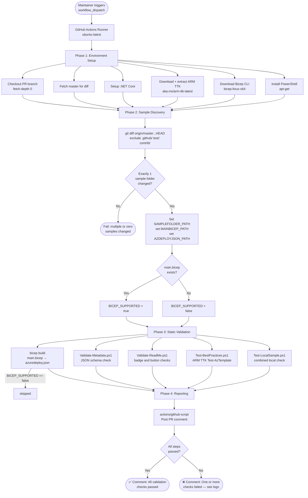

# CI/CD Pipeline Documentation — GitHub-Only Validation

> Azure Quickstart Templates — GitHub Actions Validation Pipeline (No Azure DevOps)

---

## Table of Contents

1. [Overview](#1-overview)
2. [Workflow File](#2-workflow-file)
3. [Trigger](#3-trigger)
4. [Prerequisites & Permissions](#4-prerequisites--permissions)
5. [Step-by-Step Flow](#5-step-by-step-flow)
6. [Conditional Logic](#6-conditional-logic)
7. [What This Pipeline Does NOT Do](#7-what-this-pipeline-does-not-do)
8. [Architecture Diagram](#8-architecture-diagram)

---

## 1. Overview

`validate-sample.yml` is a self-contained GitHub Actions workflow that validates a single Azure Quickstart Template sample entirely within GitHub — **no Azure DevOps, no Azure credentials, no live deployment**.

It covers all static validation checks that can be performed without connecting to Azure:

| Check | Tool |
|---|---|
| Bicep compilation | `bicep build` (official Bicep CLI) |
| `metadata.json` schema validation | `Validate-Metadata.ps1` + official JSON schema |
| `README.md` badge and button validation | `Validate-ReadMe.ps1` |
| ARM Template Best Practices | `Test-BestPractices.ps1` via ARM TTK (`Test-AzTemplate`) |
| Combined local validation | `Test-LocalSample.ps1` |

A ✅/❌ summary comment is posted on the PR when the workflow completes.

---

## 2. Workflow File

**Location**: `.github/workflows/validate-sample.yml`

**Runs on**: `ubuntu-latest`

**Shell**: Bash + `pwsh` (PowerShell Core via `apt-get`)

**No secrets required.** All tools are downloaded from public URLs at runtime.

---

## 3. Trigger

```yaml
on:
  workflow_dispatch:
```

The workflow is triggered **manually** via the GitHub Actions UI (`Actions` tab → `Validate Sample` → `Run workflow`).

> To change to automatic PR-triggered validation, replace `workflow_dispatch` with:
> ```yaml
> on:
>   pull_request:
>     branches:
>       - master
>     paths-ignore:
>       - 'test/**'
>       - '1-CONTRIBUTION-GUIDE/**'
>       - '.github/**'
> ```

---

## 4. Prerequisites & Permissions

### GitHub Token Permissions

```yaml
permissions:
  contents: read
  pull-requests: write   # needed for the summary comment step
```

### No Azure Credentials Needed

This workflow requires **zero** Azure secrets or service principals. All validation is purely static (file-based).

### Runtime Tool Downloads

| Tool | Source |
|---|---|
| ARM TTK (`arm-template-toolkit.zip`) | `https://aka.ms/arm-ttk-latest` |
| Bicep CLI (`bicep-linux-x64`) | `https://github.com/Azure/bicep/releases/latest` |
| PowerShell | `apt-get install powershell` |
| .NET SDK | `actions/setup-dotnet@v1.8.0` |

---

## 5. Step-by-Step Flow

### Phase 1 — Environment Setup

| # | Step | Detail |
|---|---|---|
| 1 | **Checkout PR branch** | `actions/checkout@v2.3.4` with `fetch-depth: 0` (full history needed for diff) |
| 2 | **Fetch master for diff** | `git fetch origin master --depth=1` — establishes baseline for changed-file detection |
| 3 | **Setup .NET Core** | `actions/setup-dotnet@v1.8.0` — required by ARM TTK |
| 4 | **Install TTK** | Downloads and extracts `arm-template-toolkit.zip` to `$RUNNER_TEMP/arm-ttk`; sets `TTK_FOLDER` env var |
| 5 | **Install Bicep CLI** | Downloads `bicep-linux-x64`, makes executable, moves to `$RUNNER_TEMP/bicep`; sets `BICEP_PATH` env var |
| 6 | **Install PowerShell** | Installs `powershell` package via `apt-get` (required to run `.ps1` CI scripts) |

### Phase 2 — Sample Discovery

| # | Step | Detail |
|---|---|---|
| 7 | **Find changed sample folder** | Diffs PR branch against `origin/master` (excluding `.github/`, `test/`, `1-CONTRIBUTION-GUIDE/`); extracts unique sample folder(s); **exits with error if more than one sample changed** (single-sample-per-PR rule); sets `SAMPLEFOLDER_PATH`, `MAINBICEP_PATH`, `AZDEPLOYJSON_PATH` |
| 8 | **Check language support** | Sets `BICEP_SUPPORTED=true` if `main.bicep` exists in the sample folder |

### Phase 3 — Static Validation

| # | Step | Condition | Detail |
|---|---|---|---|
| 9 | **Build main.bicep → azuredeploy.json** | `BICEP_SUPPORTED == true` | `bicep build main.bicep --outfile azuredeploy.json` — compiles Bicep to ARM JSON; fails the workflow if compilation errors occur |
| 10 | **Validate metadata.json** | Always | `Validate-Metadata.ps1` — validates `metadata.json` against the official schema at `https://aka.ms/azure-quickstart-templates-metadata-schema`; exits 1 on failure |
| 11 | **Validate README.md** | Always | `Validate-ReadMe.ps1` — checks Deploy-to-Azure badge link, badge SVG URL, ARM Visualizer button, Bicep badge presence (if applicable); exits 1 on failure |
| 12 | **Run ARM TTK best practices** | Always | `Test-BestPractices.ps1` — runs `Test-AzTemplate` from ARM TTK against the sample folder; exits 1 on failures |
| 13 | **Run full local sample validation** | Always | `Test-LocalSample.ps1` — combined validation pass; exits 1 if `$error.Count > 0` |

### Phase 4 — Reporting

| # | Step | Condition | Detail |
|---|---|---|---|
| 14 | **Post summary comment** | `always()` | `actions/github-script@v6` — posts a PR comment with ✅ (all passed) or ❌ (one or more failed), the sample folder path, and the list of checks that ran |

---

## 6. Conditional Logic

```
IF main.bicep exists in sample folder
    → BICEP_SUPPORTED = true
    → Step 9 runs: bicep build → azuredeploy.json
    → Subsequent validation runs against generated azuredeploy.json

IF only azuredeploy.json / mainTemplate.json exists
    → BICEP_SUPPORTED = false
    → Step 9 skipped
    → Validation runs directly against existing azuredeploy.json

IF more than one sample folder changed in the PR
    → Step 7 fails immediately (exit 1)
    → Remaining steps do not run
    → Comment step still posts failure summary (always())
```

---

## 7. What This Pipeline Does NOT Do

This is intentional — the pipeline is designed to be zero-credential and self-contained.

| Capability | Status | Reason |
|---|---|---|
| Deploy ARM/Bicep templates to Azure | ❌ Not done | Requires Azure subscription + service principal |
| Create / delete Azure Resource Groups | ❌ Not done | Requires admin service principal |
| Write results to Azure Table Storage | ❌ Not done | Requires storage account key |
| Update badge SVG files in blob storage | ❌ Not done | Requires storage account key |
| Apply GitHub PR labels | ❌ Not done | Not implemented (could be added with `pull-requests: write` permission) |
| Interact with Azure DevOps | ❌ Not done | Fully independent of AzDO |
| Deploy prerequisites templates | ❌ Not done | Requires Azure credentials |

---

## 8. Architecture Diagram


